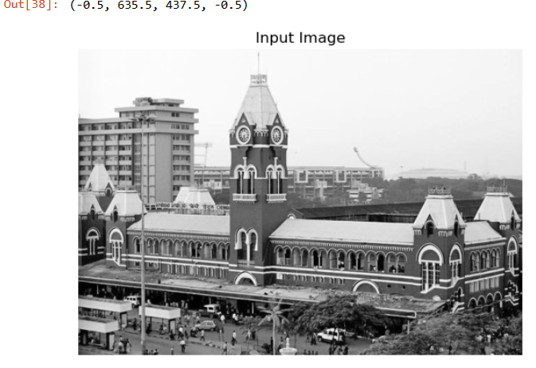
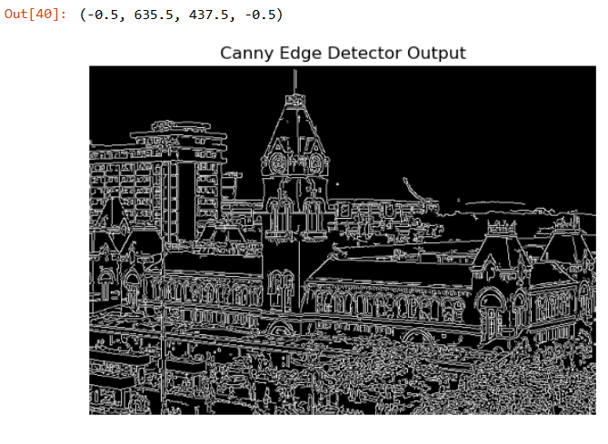
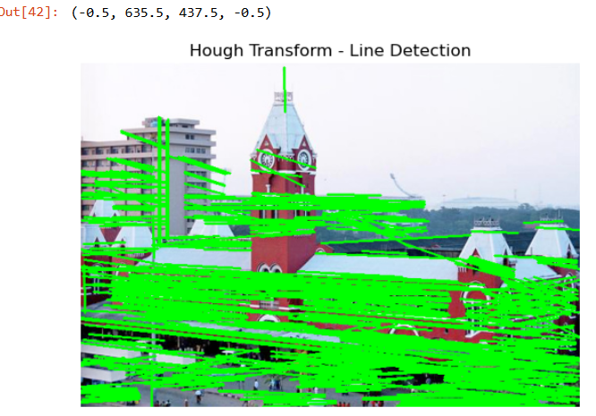

# EX-07:Edge-Linking-using-Hough-Transformm
## Aim:
To write a Python program to detect the lines using Hough Transform.

## Software Required:
Anaconda - Python 3.7

## Algorithm:
### Step1:

Import all the necessary modules for the program.
### Step2:

Load a image using imread() from cv2 module.
### Step3:

Convert the image to grayscale.
### Step4:

Using Canny operator from cv2,detect the edges of the image.
### Step5:

Using the HoughLinesP(),detect line co-ordinates for every points in the images.Using For loop,draw the lines on the found co-ordinates.Display the image.
## Output
```
Developed By: Ashwin Akash M
Reference Number: 212223230024
```
### Input image and grayscale image
```
import cv2
import matplotlib.pyplot as plt
image=cv2.imread('cartoon.jpg')
gray_image = cv2.cvtColor(image,cv2.COLOR_BGR2GRAY)
plt.imshow(gray_image,cmap="gray")
plt.title('Input Image')
plt.axis('off')
```

### Canny Edge detector output
```
edges = cv2.Canny(gray_image, 50, 150, apertureSize=3)
plt.imshow(edges, cmap='gray')
plt.title('Canny Edge Detector Output')
plt.axis('off')
```

### Display the result of Hough transform
```
lines = cv2.HoughLinesP(edges, rho=1, theta=np.pi/180, threshold=100, minLineLength=50, maxLineGap=10)
output_image = image.copy()

if lines is not None:
    for line in lines:
        x1, y1, x2, y2 = line[0]
        cv2.line(output_image, (x1, y1), (x2, y2), (0, 255, 0), 2)
plt.imshow(cv2.cvtColor(output_image, cv2.COLOR_BGR2RGB))
plt.title('Hough Transform - Line Detection')
plt.axis('off')
```

## Result:
To write a Python program to detect the lines using Hough Transform is executed successfully